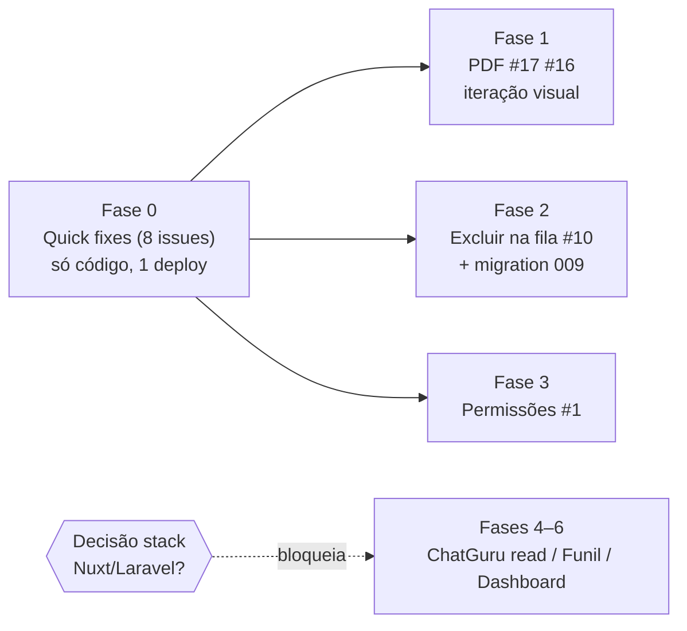

# RHF — Plano do Backlog (u4digital/RHF-Talentos) — verificado no código, 17/07

## Contexto

Teste real com o cliente (16/07) gerou as issues #1–#17 do Tiago; o dev da u4digital (postrenan) organizou o board 17/07 (#18–#26). Board 100% lido: 5 Done (backfill do já entregue), 0 In progress, 21 Todo — única priorização é o "[URGENTE]" da #26. Este plano refina o rascunho anterior **com cada afirmação verificada no código do repo** (`main` @ 3af4d1e, versão 15/jul). Correções relevantes vs. o rascunho estão marcadas com **[corrigido]**.

**⚠️ Nada é executado até você pedir no chat.** Cada fase é uma unidade deployável independente; você aprova o plano agora e dispara fase a fase depois. Mudanças no board GitHub (fechar/comentar issues) só mediante pergunta prévia a você; após executar uma atualização, documento e subo junto do commit.

**Decisão externa pendente (bloqueia Fases 4–6):** issues do postrenan citam "Nuxt/Laravel" — stack que não existe na plataforma em produção (HTML/JS vanilla + Vercel Functions + Supabase). Alinhar com Tiago/Renan quem implementa e em qual stack. Fases 0–3 valem em qualquer cenário.

---

## Fase 0 — Quick fixes de produção (1 deploy, prioridade máxima)

### #26 + #15 (URGENTE, duplicadas) — formulário reaproveita dados do CV anterior

**[corrigido] Causa raiz encontrada:** `updateCurriculoSourceData()` (`mvp.html:2197`) atualiza o painel do candidato mas **não limpa** os campos complementares `comp-*` nem a foto (`_cvPhotoDataUrl`, `mvp.html:2230`) ao trocar de candidato — pretensão, nascimento, cidade, info_extra e foto do candidato anterior vão para o CV novo. `prefillComplementarFromImport()` (`mvp.html:2357`) agrava: só preenche campos não-vazios, deixando o resto sujo.

**Fix:** criar `clearComplementarFields()` — zera todos os inputs `comp-*` (ids listados no map de `generateCV()`, `mvp.html:2517–2529`), `_cvPhotoDataUrl = null` e o `photo-preview` (padrão de reset já existe em `removePhoto`/`openNovoCandidatoModal`, `mvp.html:2402`). Chamar em `updateCurriculoSourceData()` quando o candidato muda, e no sucesso de `generateCV()`.

### #5 — campos com fundo branco ilegíveis

**[corrigido] Não é o token:** `--bg-white` já é escuro (`#10121d`, `mvp.html:13`). Os ilegíveis são **fundos `#fff` hardcoded em páginas dark-themed** com texto `var(--text)` (#eef0f8 claro):
- `configuracoes.html`: `.modal` (linha 188), `.form-input:focus{background:#fff}` (197), cards de integração (575, 583, 591) — página tem `:root` dark igual ao mvp.
- `mvp.html:3272–3300`: `emailModal` é uma ilha light-styled (card `#fff`); inputs sem cor explícita.

**Fix:** trocar `#fff` por `var(--bg-white)`/tokens glass; restilizar o `emailModal` no padrão dark dos outros modais (referência: `groupSummaryModal`, `mvp.html:1353`). Auditoria final: `grep -n "background:#fff\|background: #fff\|#ffffff" *.html` em todas as páginas + teste de autofill do browser.

### #11 — destaque deve ser "Preparar arquivo", não e-mail

`mvp.html:2641`: botão `prepareCvFile` hoje é `cv-btn secondary`. Inverter: ele vira `primary` (laranja); o botão de e-mail vira `secondary`.

### #13 — fila não mostra quem enviou

`created_by_name` já é salvo (`api/cv.js:600`) e `handleQuery` faz `select *` — o dado **já chega** ao front. Só adicionar a linha do recrutador no template de `loadDeliveryQueue()` (`mvp.html:2894–2925`).

### #7 — e-mail sem identidade RHF

Corpo do e-mail montado em `handleSendEmail` (`api/cv.js:676–691`). Inserir a introdução padrão do Tiago ("Prezados, Possuímos um novo candidato...") como parágrafo antes das seções, dentro do card branco.

### #9 — tag "1164" é código da unidade, inútil

Tags do upload em `handlePrepareFile` (`api/cv.js:769–772`): hoje só o nº do processo. Trocar por **nome do recrutador** (`cv.created_by_name`) + **nome do processo/vaga** + **cidade** (parsear de `cv.vacancy_name`, formato "#1164 - Título - Cidade/UF" — regex de limpeza já existe em `mvp.html:2819`). Atenção: `edit_tags` do painel recebe CSV (`lib/chatguru-panel.js:121–126`) — tags não podem conter vírgula.

### #8 — campo observações ignorado

`info_extra` hoje só vira snippet de 80 chars no resumo-template fallback (`api/cv.js:262–264`). **[corrigido] O caminho principal é a IA:** `rewriteCvWithAI()` (`api/cv.js:481`) não recebe `info_extra`. Passar `complementar.info_extra` no payload e instruir o prompt (`api/cv.js:~470–480`) a integrar o conteúdo (resumo ou bullets de informações complementares).

### #14 — normalizar qualquer formato + correção gramatical

Dois prompts a ajustar: o de reescrita (`rewriteCvWithAI`, `api/cv.js:~470`) e o de import de PDF (`api/cv.js:~848+`). Instrução explícita de: correção gramatical/ortográfica, e normalização ao padrão infojobs independente da origem do currículo.

## Fase 1 — Fidelidade do PDF (#17, #16)

- **#17 (páginas 2+ sem margem):** `cv-print.html:523–528` usa `margin: 0` no html2pdf — o `@page {margin: 0.8cm 1cm}` (linha 216) só vale para impressão nativa, não para o html2pdf. Configurar `margin` no `html2pdf().set()` + `page-break-inside: avoid` nos blocos de seção. Cuidado: o cabeçalho da página 1 é full-bleed — margem global pode quebrá-lo; iterar (compensar com margem negativa no header ou `pagebreak: {mode: ['css','legacy']}`).
- **#16 (logo em baixa qualidade):** o PNG é 1492×976 nativo — a perda é na rasterização (`html2canvas.scale: 2`). Subir para 3 e revisar `image.quality`; monitorar o limite de 8MB do `handlePrepareFile` (`api/cv.js:750`).
- Fase separada porque html2pdf exige tentativa-e-erro visual (gerar → conferir → ajustar). Os pares bruto→pronto de referência estão na sua máquina (`~/Downloads/rhf att/`) — validação final é sua.

## Fase 2 — Fila: "Desfazer" vira "Excluir" (#10)

Cliente espera exclusão real (plataforma + ChatGuru). Hoje "Desfazer" (`mvp.html:2905`) só faz `markDelivered(undo)` — não apaga nada.
1. **Migration 009:** coluna `chatguru_attachment_id` em `generated_cvs` — o id **já é retornado** (`api/cv.js:799`) mas não persistido; salvar no patch de `handlePrepareFile` (`api/cv.js:789`). Fallback p/ CVs antigos: busca por nome via `/attachments/search` (padrão já escrito em `lib/chatguru-panel.js:114–118`).
2. **`action=delete-file` em `api/cv.js`:** apaga do ChatGuru (**`deleteArquivo()` já existe**, `lib/chatguru-panel.js:140`), apaga do Storage (**criar `deleteFromStorage()` em `lib/supabase.js`** — hoje só há upload, linha 95) e limpa `sent_status`/`sent_file_url`.
3. UI: botão "Excluir" com confirmação no lugar de "Desfazer".
- Aplicar migration via `scripts/apply-migration.js` (lê `SUPABASE_URL`/`SUPabase_SERVICE_KEY` do env — credenciais em `CREDENCIAIS.md`).

## Fase 3 — Permissões por perfil (#1)

- Backend **já pronto**: roles `admin`/`recrutador` em `api/auth.js` (validação linha 201, retornado no login linhas 107/147); `window.RHF_USER` já populado (`mvp.html:629`).
- Falta: gating do nav por `RHF_USER.role` em `mvp.html` (recrutador vê só Gerador de CV + fila; admin vê tudo) + checagem de role nas actions administrativas do backend. Testar com a Daniela (recrutadora real).

## Fases 4–6 — Roadmap (bloqueadas na decisão de stack)

- **Fase 4 (fundação):** API REST s18 não tem leitura (~22 ações sondadas). Caminho: sessão do painel (`lib/chatguru-panel.js`, já funciona p/ Arquivos) — sondar rotas de tags/funil/chats; motor `action=sync-tags` no `api/whatsapp.js` (respeita limite de 12 funções Vercel — hoje são 11); cron via GitHub Actions (Vercel Hobby só tem cron diário); tabelas novas (migrations 009/010).
- **Fase 5 (#2, #23):** funil espelhado ChatGuru→RHF (unidirecional) + etapas próprias + drag-and-drop no Funil de Vagas existente.
- **Fase 6 (#3/#25, #4):** dashboard com filtros/métricas reais por tag; "Gerar Resumo" IA editável → grupo WhatsApp — **backend dormant já existe** (`send-summary` em `api/whatsapp.js:36`, tabela `chatguru_groups` migration 008, modal `groupSummaryModal` `mvp.html:1353`); módulo Conversa só-grupos (escopo a fechar com o cliente).

## Board GitHub (u4digital/RHF-Talentos)

Conforme combinado: **pergunto antes de qualquer escrita no board**. Duplicatas mapeadas p/ referência: #26↔#15, #25↔#3, #23↔funil existente; #6 (antivírus) resolvido pelo próprio cliente. Após cada fase executada, documento a entrega e subo ao GitHub junto do commit.

## Verificação (quando você pedir a execução)

Por fase: deploy `npx vercel --prod --yes` + alias obrigatório → E2E em produção (gerar CV real de teste; conferir formulário limpo ao trocar candidato, contraste dos campos, PDF/margens/logo, tags no ChatGuru, coluna do recrutador na fila, e-mail com introdução; limpar artefatos de teste) → screenshot p/ validação Tiago/Rodrigo → commit + snapshot no repo u4digital (`versao-DDmmm`). Se o token Vercel não estiver no env desta sessão, deixo o código commitado/pushed e o deploy sai do seu terminal.

## Fora do escopo

Rewrite Nuxt/Laravel (se for o caminho da u4digital, é projeto próprio), Pandapé (standby oficial), LGPD (adiado).
